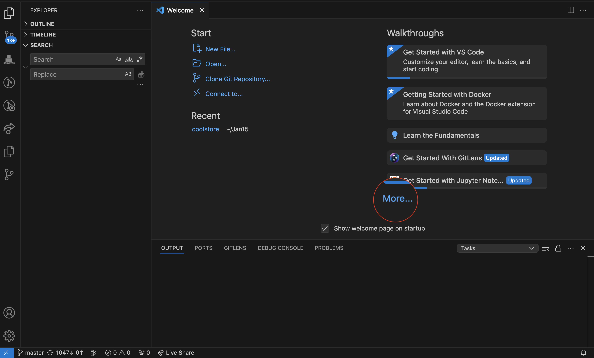
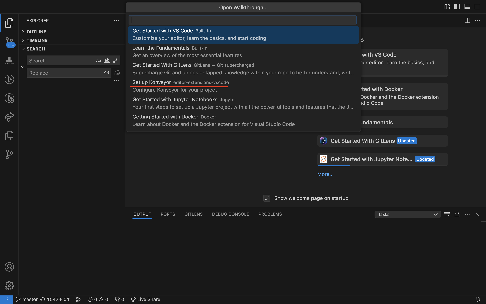
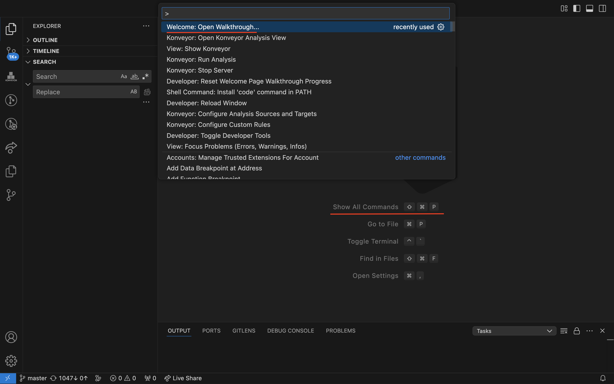
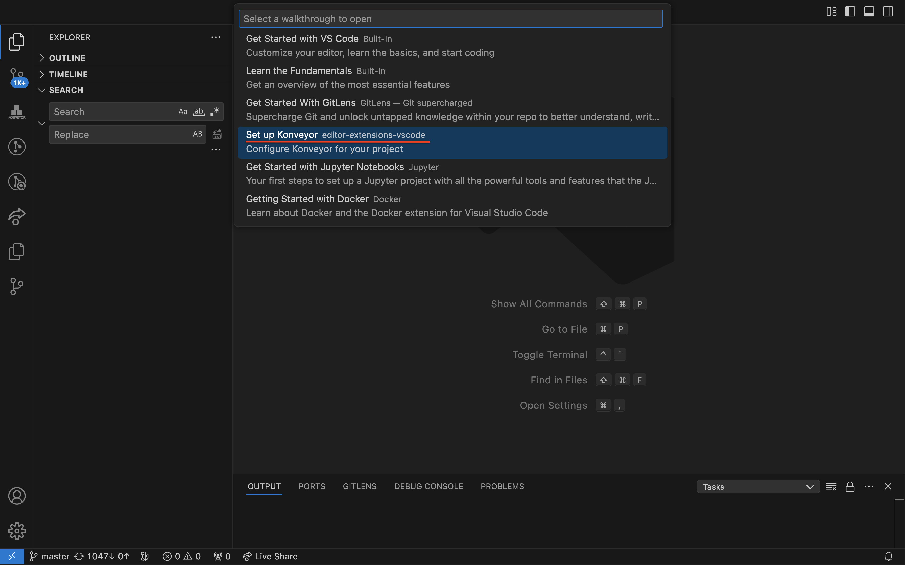
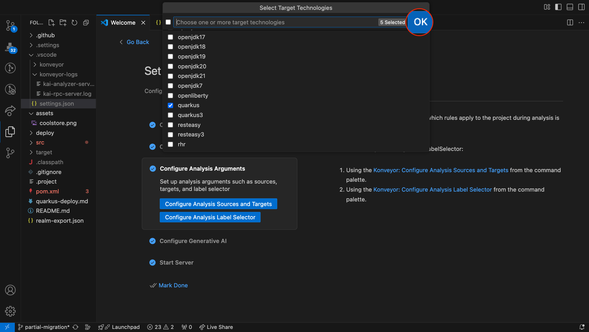

# Using the IDE Plugin

## Get a Demo App or Any App You Like to Migrate

1. Clone the Cool-store application:
   ```bash
   git clone https://github.com/konveyor-ecosystem/coolstore.git
   ```
2. Navigate to File > Open in VSCode and locate the folder we just cloned.

### Running Kai RPC server

1. Users will land on the welcome page after installation as shown below. If the Welcome Page does not appear, proceed to the step 2.
   
   If "Set up Konveyor" is not available in the list, click the More button for additional options.
   
2. If the welcome page does not appear, open the command palette by pressing Command + Shift + P. This will bring up a list of commands.
   
   From the command palette, locate and select the "Set up Konveyor" option. This will guide you through the configuration process.
   
3. Configure Konveyor for your project.
   - User has an option to override binaries and custom rules, however it comes with the default packaged binaries and custom rules.
     
   - The Konveyor extension allows you to add custom rules to the analyzer. This is useful when you want to apply your own rules during analysis.
   - Configuring analysis arguments is necessary to determine which rules apply to the project during analysis. Set up analysis arguments specific to your project by selecting the appropriate options and pressing "OK" to save the changes.
     - To confirm your arguments, navigate to your project directory and open `/.vscode/settings.json`.
       
   - Next, set up the Generative AI key for your project. This step will open the `provider-settings.yaml` file. By default, it is configured to use OpenAI. To change the model, update the anchor `&active` to the desired block. Modify this file with the required arguments, such as the model and API key, to complete the setup. Sample of the `provider-settings.yaml` can be found [here.](https://github.com/konveyor/editor-extensions/blob/main/vscode/resources/sample-provider-settings.yaml)
   - As the final step, select "Get Solution Parameters".
4. Once the configuration is done, click on start server button. Logs are collected at output channel named konveyor-analyzer.
   
